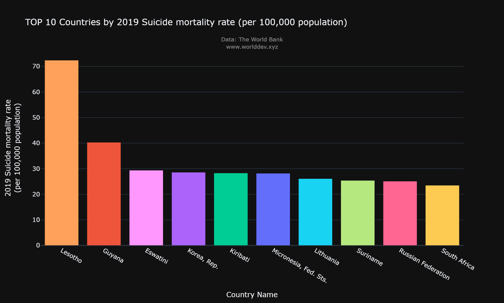
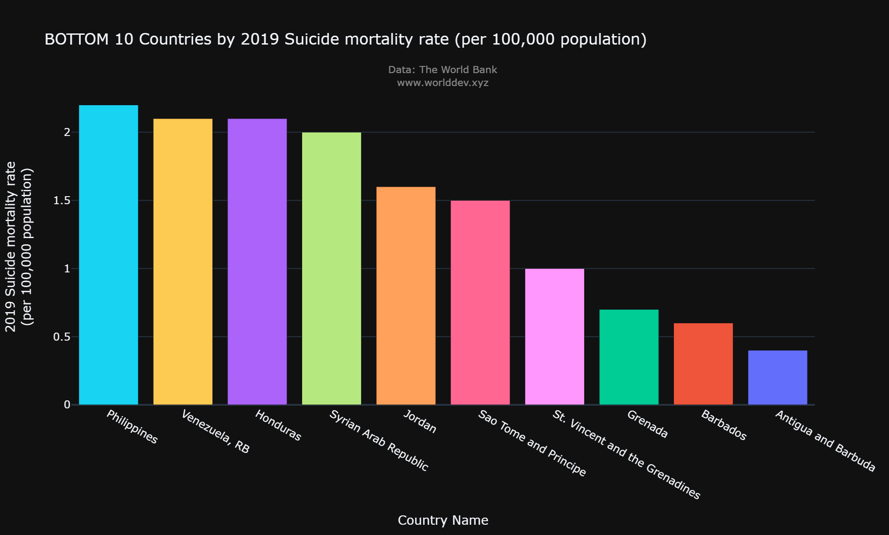
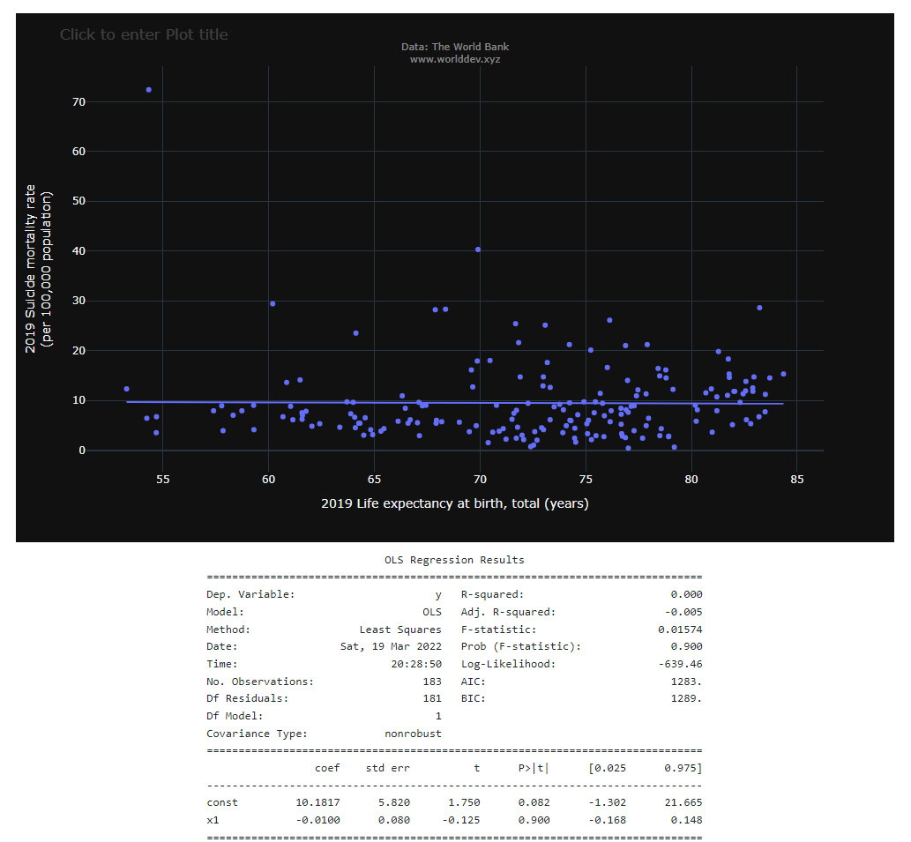
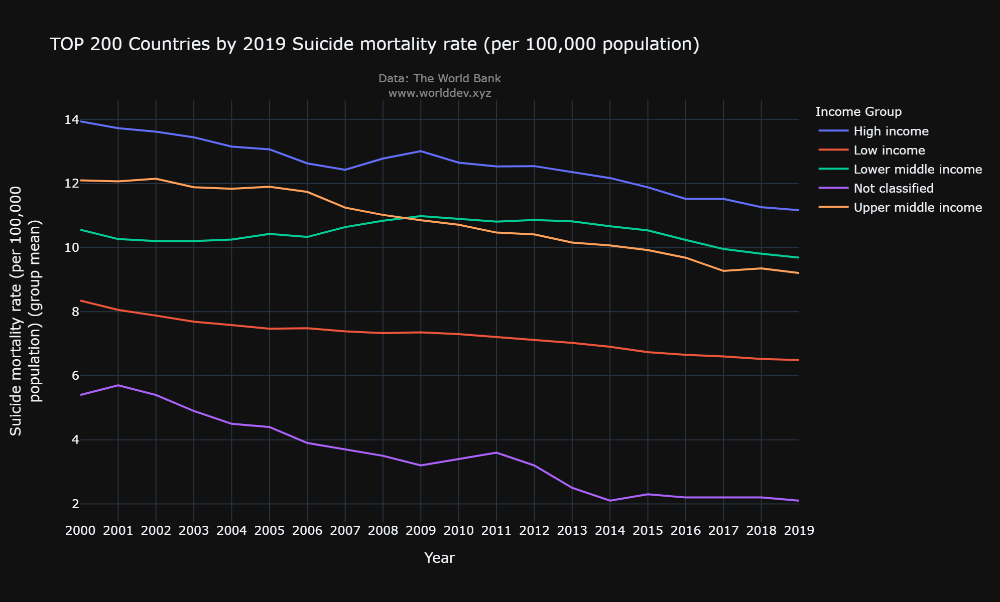

# Individualism and Suicide

**Anna Perfilyeva**

Suicide is an important global health issue. It is estimated that 800,000 deaths per year occur due to suicide (1) and it is the fourth leading cause of death for youth 15-19 years old (2). Risk factors for suicide include mental health issues, alcohol and drug abuse, stress, abuse and trauma. Although there is a significant mental health aspect to this issue, social factors play a critical role in individuals’ risk of suicide. World Bank data offers a glimpse into how cultural factors are affecting this issue. In particular, I would like to look into how a country’s level of individualism affects suicide rates, using the World Bank data available at World Development Explorer (worlddev.xyz). 

## Global Outlook

First let's take a look at countries with the highest and lowest suicide rates, expressed as the number of suicide deaths per 100,000 individuals in a given population, based on 2019 World Bank data:

Across all nations, suicide rates range from less than 0.5 suicide deaths to over 70 deaths per 100,000 people. Lesotho, a country in Sub-Saharan Africa, has the largest suicide rate in the world, 72 persons per 100,000 commit suicide - more than double the incidence compared to the average rates in the other 9 top suicide countries. The primary reasons for this are thought to be extreme poverty and a high HIV prevalence. Notably, countries with lowest suicide rates are also predominantly lower-income economies. 

## Correlation of Suicide Rates with Income and Health 

Before we look into how individualism affects suicide rates, it is worth understanding how suicides correlate with country's income, represented in the data by GDP per capita, and the general health status, represented by life expectancy rates. We know that income is a powerful determinant of many social and health outcomes; higher incomes are typically associated with better outcomes. We would therefore expect that suicides are generally higher in lower income countries. Fitting a simple linear regression model on GDP and suicides data does not support this hypothesis: in fact, there is a slight upward trend in suicides as the country income increases. The P-value on the slope coefficient is relatively high, at 0.118, indicating that the positive correlation between suicide rates and a country's income is not statistically significant.

### Suicide Correlation with GDP

Similarly, looking at suicide rates across the life expectancy ranges, we would expect that more suicides tend to occur in countries where healthcare system is lacking, which affects both mental health and the general health status of individuals. In countries with successul healthcare systems and therefore higher life expectancy, we would expect suicide rates to be lower. Again, the simple linear regression of suicide rates against a country’s life expectancy does not quite confirm this. There in fact appears to be a small decrease in suicide rates as the country’s life expectancy increases; however, the P-value, at 0.082, shows a low statistical significance of this relationship. 

### Suicide Correlation with Life Expectancy

## Suicide trends over time

To understand how suicide rates have changed over time, we will group countries into 5 income categories and start back at 2000. 

The good news is that globally, suicide rates have been decreasing across all country income groups. This chart also shows that high income countries have higher suicide rates, followed by countries with lower middle income. Perhaps the stressors of living in a high income society, such as inequality of income and opportunity, can be higher than living in a country with lower overall income.

## How Individualistic Culture Affects Suicide

To better understand factors that lead to suicide, we will now look at society’s level of individualism vs. collectivism. World Bank defines individualism as a belief that government should not affect people’s choices. In day-to-day life we associate it with the high opportunity for self-realization and individual freedoms, and a lower reliance on the community. Individualistic cultures place more value on each person’s achievements, characteristics and concerns, whereas collectivist cultures place higher value on groups and communities, and tend to focus more on a person’s role in relation to other people, e.g. whether a person is a good friend, team player, coworker, etc. For reference, United States, Australia and United Kingdom rank highest on the individualism scale; Venezuela, Colombia and Indonesia rank lowest.

There are two different, in fact opposite, ways in which a society's level of individulaism can affect suicides: one hypothesis would be that higher individual freedoms make people happier, more self-fulfilled, and therefore reduce suicides. Another hypothesis is that a lower level of social connection in countries with higher individualis makes people feel more isolated and disconnected, leading to the increase in suicides. Plotting a simple linear regression of suicide rates against society's level of individualism, we see that there is a positive correlation between these variables, i.e. higher individualism is associated with higher suicide rates, supporting the second hypothese. Moreover, this relationship is statistically significant, with a P value of 0.012.  

### Suicide Correlation with Individualism

So, it appears that despite the many benefits that individualistic cultures offer, they are also associated with higher rates of suicides. It seems plausible that the lower level of community connection and social support results in a feeling of loneliness that can aggravate to where a person wants to end their life. Moreover, if we consider that an act of suicide is only the most visible and acute outcome of the mental pain and suffering an individual goes through, it’s likely that individualism is a factor in other mental health issues, such as stress and depression. It is therefore very important to create and strengthen communities and foster social support through schools, work organizations and places of worship, while respecting individual freedoms. 

 Sources:
 1. https://psycnet.apa.org/record/2018-49833-033
 2. https://www.who.int/news-room/fact-sheets/detail/suicide

